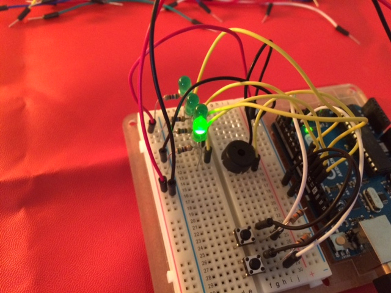

# Is It Odd

Simple game that asks the user to decide if a displayed 4-bit binary number indicated by the lights is even. Yeah...not too difficult if you know how to read binary numbers.

Simple experiment in wiring up LEDs, Piezo element, and buttons after working through the [ARDX experimentation kit](http://www.adafruit.com/products/170).

## Board

